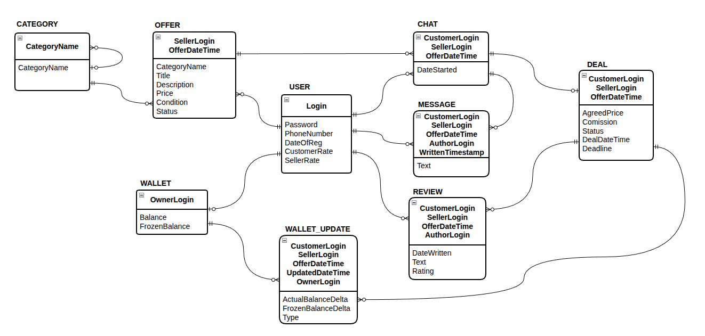
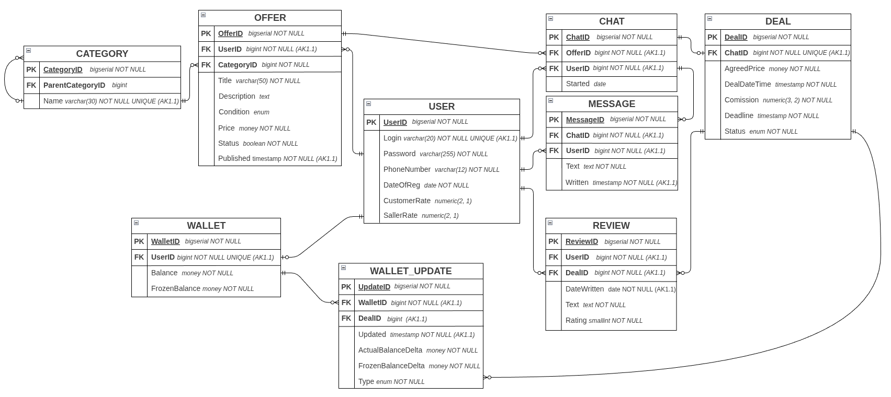

## Обзор и анализ предметной области

### Описание бизнес-процессов

Система онлайн-сервиса для продаж должна автоматизировать следующие бизнес-процессы:

1. #### Управление объявлениями

    * **Описание процесса**  
    
        Зарегистрированный пользователь (Продавец) создает объявление, указывая заголовок, описание, категорию, цену и состояние товара. Объявления группируются по категориям для удобства поиска и нафигации.

    *   **Бизнес-правила**

        1. Объявление обязательно должно быть привязано к конкретной категории.

        2. Продавец может редактировать данные объявления до момента заключения сделки, а также снимать объявления с продажи.

        3. Один пользователь (Продавец) может создать неограниченное число объявлений, после удачной сделки объявление должно быть помечено флагом "неактуально".

        4. Цена товара должна быть положительным числом.
    
    * **Ограничения**

        1. Удаление категории невозможно, если к ней привязаны активные объявления.
        
        2. Редактирование объявления невозможно, если есть связанная с объявлением сделка.

2. #### Взаимодействие пользователей и система чатов

    * **Описание процесса**  
    
        Покупатель инициирует диалог с продавцом через систему чатов для уточнения деталей. Все сообщения привязываются к конкретному чату, созданному в рамках предложения.

    *   **Бизнес-правила**

        1. Чат создается между двумя уникальными пользователями (Покупатель и Продавец) относительно конкретного объявления.

        2. Сообщения внутри чата хранят историю переписки с фиксацией времени отправки.
    
    * **Ограничения**

        1. Пользователь не может начать чат с самим собой (купить свой товар).

3. #### Проведение «Безопасной сделки» и финансовый учет
    
    * **Описание процесса**  
    
        Система выступает гарантом. При оформлении сделки средства на кошельке покупателя переходят в статус «замороженных». После успешного подтверждения получения товара средства (за вычетом комиссии сервиса) переводятся на баланс продавца.

    *   **Бизнес-правила**

        1. Сделка создается на основе чата, связанного с конкретным объявлением.

        2. Каждое изменение баланса (заморозка, пополнение, списание, выплата) фиксируется в истории обновлений кошелька.

        3. Сумма сделки может отличаться от цены в объявлении, поэтому согласованная цена должна храниться в информации о сделке.
    
    * **Ограничения**

        1. Сделка не может быть начата, если баланс кошелька покупателя меньше Согласованной цены.

        2. Списание денег со счета не может привести к отрицательному балансу.

4. #### Система рейтингов и отзывов
    
    * **Описание процесса**  
    
        После завершения или отмены сделки стороны могут оставить отзыв. На основе оценок в отзывах формируется средний рейтинг пользователя: как продавца и как покупателя.

    *   **Бизнес-правила**

        1. Отзыв привязан к конкретной завершенной сделке.

        2. Автор отзыва должен быть участником сделки: продавцом или покупателем.

    
    * **Ограничения**

        1. По одной сделке не может быть более одного отзыва от одного и того же пользователя.

### Функциональные требования информационной системы
    
1. #### Управление пользователями и кошельками
    
    * Система должна обеспечивать регистрацию пользователей с уникальным логином.

    * Для каждого пользователя при первом пополнении баланса должен создаваться кошелек для управления денежными средствами.

    * БД должна хранить историю всех изменений баланса для проведения финансового аудита

2. #### Размещение и категоризация контента

    * Система должна поддерживать древовидную структуру категорий. Например, объявление о продаже мобильного телефона может содержать категории: "Электронника" -> "Мобильные устройства" -> "Смартфоны" -> "Марка производителя".

    * БД должна обеспечивать хранение подробных метаданных товара (состояние, цена, описание).

3. #### Механизм "Безопасных сделок"

    * БД должна поддерживать статусы сделок, например: "Ожидает оплаты", "Оплачено", "Доставлено", "Завершено", "Оспорено".

    * Система должна автоматически рассчитывать комиссию сервиса при формировании сделки.

    * БД должна гарантировать атомарность операций при переводе средств из Баланса на Замороженные средства.

4. #### Коммуникации

    * Система должна позволять фильтровать сообщения по времени и автору внутри конкретного чата.

    * БД должна поддерживать хранение больших объемов текстовых данных (сообщения, отзывы).

5. #### Контроль целостности и бизнес-ограничений

    * Система должна блокировать возможность оставить более одного отзыва от одного автора по одной и той же сделке.

    * БД должна обеспечивать автоматическое обновление рейтингов Продавца и Покупателя при добавлении новых отзывов/изменении старых.

    * При удалении пользователя система должна обрабатывать связанные записи.

## Разработка ER-модели предметной области

### Описание сущностей

На основе описанной предметной области была создана модель «сущность-связь» (рис. 1)

  
   
  <em>Рисунок 1 — Модель сущность-связь</em>
</p

Ниже приведено описание девяти основных сущностей, входящих в разработанную модель:

* **USER** — сущность, являющаяся абстракцией пользователя системы. Идентификатор: `Login`. Атрибуты: `Password` (пароль), `PhoneNumber` (номер телефона), `DateOfReg` (дата регистрации), `CustomerRate` и `SellerRate` (рейтинги покупателя и продавца).

* **CATEGORY** — сущность, описывающая дерево разделов объявлений. Идентификатор: `CategoryName`. Атрибуты: `CategoryName` (название категории), а также рекурсивная связь для поддержки иерархии.

* **OFFER** — сущность, являющаяся абстракцией объявления о продаже. Идентификатор состоит из `SellerLogin` (логин пользователя, разместившего объявление) и `Published` (время публикации). Атрибуты: `Title` (заголовок), `Description` (описание), `Price` (цена), `Condition` (состояние товара) и `Status` (актуальность).

* **CHAT** — сущность, являющаяся абстракцией диалога между пользователями. Идентификатор включает `CustomerLogin`, `SellerLogin` и `Published` (ссылка на объявление). Атрибут: `DateStarted` (дата начала общения).

* **MESSAGE** — сущность, описывающая конкретное сообщение в чате. Идентификатор состоит из ключа чата, `AuthorLogin` и `Written` (временная метка). Атрибут: `Text` (содержание сообщения).

* **DEAL** — сущность, являющаяся абстракцией «Безопасной сделки». Идентификатор совпадает с ключом чата. Атрибуты: `AgreedPrice` (согласованная цена), `Comission` (комиссия), `Status` (статус сделки), `DealDateTime` (дата совершения) и `Deadline` (срок выполнения).

* **WALLET** — сущность, описывающая финансовый счет пользователя. Идентификатор: `OwnerLogin`. Атрибуты: `Balance` (доступные средства) и `FrozenBalance` (замороженные средства).

* **WALLET_UPDATE** — сущность, являющаяся абстракцией лога изменений баланса. Идентификатор включает ключ сделки, `Updated` (время изменения) и `OwnerLogin`. Атрибуты: `ActualBalanceDelta`, `FrozenBalanceDelta` и `Type` (тип операции).

* **REVIEW** — сущность, являющаяся абстракцией отзыва по сделке. Идентификатор включает ключ сделки и `AuthorLogin`. Атрибуты: `DateWritten`, `Text` и `Rating` (оценка).

### Описание связей между сущностями

Между описанными сущностями были построены связи, соответствующие бизнес-логике C2C-сервиса:

* **CATEGORY и CATEGORY:** Так как одна категория может содержать в себе множество подкатегорий, связь является связью типа «один-ко-многим». Минимальные кардинальные числа равны **1:0** (у категории может не быть родителя, если она корневая).

* **CATEGORY и OFFER:** Так как в одной категории может быть размещено множество объявлений, а объявление относится к одной категории, связь — «один-ко-многим». Минимальные кардинальные числа **1:0** (в категории может не быть объявлений).

* **USER и OFFER:** Один пользователь может создать неограниченное число объявлений, поэтому связь «один-ко-многим». Минимальные кардинальные числа **1:0** (пользователь может ничего не продавать).

* **OFFER и CHAT:** По одному объявлению может быть создано множество чатов с разными покупателями, связь — «один-ко-многим». Минимальные кардинальные числа **1:0** (по новому объявлению может не быть обращений).

* **USER и CHAT:** Каждый чат инициируется конкретным покупателем, связь — «один-ко-многим». Минимальные кардинальные числа **1:0**.

* **CHAT и MESSAGE:** В рамках одного чата может быть написано множество сообщений, связь — «один-ко-многим». Минимальные кардинальные числа **1:0** (в чате может не быть сообщений).

* **CHAT и DEAL:** Сделка заключается на основе конкретного чата, связь — «один-к-одному». Минимальные кардинальные числа **1:0** (чат может не привести к сделке).

* **USER и WALLET:** Каждому пользователю соответствует один кошелек, связь — «один-к-одному». Минимальные кардинальные числа **1:0** (кошелек создается пользователем перед первой транзакцией).

* **WALLET и WALLET_UPDATE:** Один кошелек имеет множество записей в истории изменений, связь — «один-ко-многим». Минимальные кардинальные числа **1:0** (кошелек может не иметь изменений).

* **DEAL и WALLET_UPDATE:** Сделка порождает несколько записей об изменении баланса (заморозка, выплата), связь — «один-ко-многим». Минимальные кардинальные числа **1:0** (транзакция может быть не связана со сделкой, например, пополнение).

* **DEAL и REVIEW:** По одной сделке может быть оставлен отзыв, связь — «один-к-одному». Минимальные кардинальные числа **1:0** (сделка может завершиться без отзыва).

## Проектирование и реализация реляционной модели

### Преобразование разработанной ER-модели в реляционную модель

На основе разработанной ранее модели «сущность-связь» была спроектирована реляционная модель (рис. 2).

  
   
  <em>Рисунок 2 — Реляционная модель базы данных</em>

#### 1. Описание таблиц

##### 1.1. USER (Пользователи)
* `UserID` BIGSERIAL NOT NULL (суррогатный первичный ключ);

* `Login` VARCHAR(20) NOT NULL (уникальный логин, ключ-кандидат);

* `Password` VARCHAR(255) NOT NULL (хэш пароля);

* `PhoneNumber` VARCHAR(12) NOT NULL (номер телефона);

* `DateOfReg` DATE NOT NULL (дата регистрации);

* `CustomerRate` NUMERIC(2,1) NULL (рейтинг как покупателя);

* `SellerRate` NUMERIC(2,1) NULL (рейтинг как продавца).

##### 1.2. CATEGORY (Категории)
* `CategoryID` BIGSERIAL NOT NULL (суррогатный первичный ключ);

* `ParentCategoryID` BIGINT NULL (внешний ключ на эту же таблицу для иерархии);

* `Name` VARCHAR(30) NOT NULL (название категории, уникальный ключ-кандидат).

##### 1.3. OFFER (Объявления)
* `OfferID` BIGSERIAL NOT NULL (суррогатный первичный ключ);

* `UserID` BIGINT NOT NULL (внешний ключ, ссылка на продавца);

* `CategoryID` BIGINT NOT NULL (внешний ключ, ссылка на категорию);

* `Title` VARCHAR(50) NOT NULL (заголовок);

* `Description` TEXT NULL (подробное описание);

* `Condition` ENUM NOT NULL (состояние товара: новый/б.у.);

* `Price` MONEY NOT NULL (цена товара);

* `Status` BOOLEAN NOT NULL DEFAULT true (активно/снято);

* `Published` TIMESTAMP NOT NULL (время публикации).

##### 1.4. CHAT (Чаты)
* `ChatID` BIGSERIAL NOT NULL (суррогатный первичный ключ);

* `OfferID` BIGINT NOT NULL (внешний ключ, ссылка на объявление);

* `UserID` BIGINT NOT NULL (внешний ключ, ссылка на покупателя);

* `Started` DATE NOT NULL (дата создания чата).

##### 1.5. MESSAGE (Сообщения)
* `MessageID` BIGSERIAL NOT NULL (суррогатный первичный ключ);

* `ChatID` BIGINT NOT NULL (внешний ключ, ссылка на чат);

* `UserID` BIGINT NOT NULL (внешний ключ, автор сообщения);

* `Text` TEXT NOT NULL (содержание);

* `Written` TIMESTAMP NOT NULL (время отправки).

##### 1.6. DEAL (Сделки)
* `DealID` BIGSERIAL NOT NULL (суррогатный первичный ключ);

* `ChatID` BIGINT NOT NULL (внешний ключ, ссылка на чат, уникальный);

* `AgreedPrice` MONEY NOT NULL (итоговая цена сделки);

* `Comission` NUMERIC(3,2) NOT NULL (комиссия сервиса);

* `Status` ENUM NOT NULL (статус: оплачено/доставлено/завершено);

* `DealDateTime` TIMESTAMP NOT NULL (время создания сделки);

* `Deadline` TIMESTAMP NOT NULL (срок подтверждения).

##### 1.7. WALLET (Кошельки)
* `WalletID` BIGSERIAL NOT NULL (суррогатный первичный ключ);

* `UserID` BIGINT NOT NULL (внешний ключ, уникальный);

* `Balance` MONEY NOT NULL DEFAULT 0 (доступные средства);

* `FrozenBalance` MONEY NOT NULL DEFAULT 0 (замороженные под сделки средства).

##### 1.8. WALLET_UPDATE (Обновления кошелька)
* `UpdateID` BIGSERIAL NOT NULL (суррогатный первичный ключ);

* `WalletID` BIGINT NOT NULL (внешний ключ, ссылка на кошелек);

* `DealID` BIGINT NULL (внешний ключ, ссылка на сделку, может быть NULL);

* `ActualBalanceDelta` MONEY NOT NULL (изменение основного баланса);

* `FrozenBalanceDelta` MONEY NOT NULL (изменение замороженного счета);

* `Type` ENUM NOT NULL (тип: пополнение/заморозка/выплата);

* `Updated` TIMESTAMP NOT NULL (время операции).

##### 1.9. REVIEW (Отзывы)
* `ReviewID` BIGSERIAL NOT NULL (суррогатный первичный ключ);

* `DealID` BIGINT NOT NULL (внешний ключ, ссылка на сделку);

* `AuthorID` BIGINT NOT NULL (внешний ключ, кто оставил отзыв);

* `Rating` SMALLINT NOT NULL CHECK (Rating BETWEEN 1 AND 5);

* `Text` TEXT NOT NULL;

* `DateWritten` DATE NOT NULL.

#### 2. Обоснование и логика связей

##### 2.1. Обоснование ограничений кардинальности

* **USER — OFFER (1:N)**: Один пользователь может разместить неограниченное количество объявлений, в то время как каждое объявление публикуется строго одним автором (продавцом). Минимальная кардинальность — **M-O** (Mandatory-Optional), так как в системе может существовать пользователь без активных объявлений, но объявление не может существовать без указания автора.

* **CATEGORY — OFFER (1:N)**: Каждая категория может объединять множество товаров, но конкретное объявление привязывается только к одной категории. Минимальная кардинальность — **M-O**, что допускает существование в справочнике новых или сезонных категорий, в которых временно отсутствуют товары.

* **CATEGORY — CATEGORY (1:N)**: Рекурсивная связь для реализации иерархического дерева. Одна родительская категория может содержать несколько дочерних. Минимальная кардинальность — **M-O**, так как корневые категории не имеют родителя (`NULL`), а конечные категории («листья») не имеют вложенных подразделов.

* **OFFER — CHAT (1:N)**: По одному объявлению может быть инициировано несколько независимых диалогов с разными потенциальными покупателями. Минимальная кардинальность — **M-O**, так как по новому или непопулярному товару может не быть создано ни одного чата.

* **USER — CHAT (1:N)**: Связь определяет пользователя в роли покупателя. Один пользователь может интересоваться множеством товаров и иметь множество чатов. Минимальная кардинальность — **M-O**.

* **CHAT — MESSAGE (1:N)**: В рамках одного диалога может быть отправлено неограниченное количество сообщений. Минимальная кардинальность — **M-O**, так как чат технически инициируется нажатием кнопки "Вступить в диалог" покупателем, а сообщение не имеет смысла вне контекста чата.

* **CHAT — DEAL (1:1)**: Сделка является логическим продолжением успешного обсуждения в чате. Минимальная кардинальность — **M-O**, так как не каждый чат завершается оформлением «Безопасной сделки». Ограничение «один-к-одному» гарантирует, что по одной договоренности не будет создано дублирующих финансовых обязательств.

* **USER — WALLET (1:1)**: Каждому пользователю соответствует строго один личный счет. Минимальная кардинальность — **M-O**, что реализует стратегию «ленивого создания»: запись в таблице кошельков появляется только при первой финансовой активности (пополнение или покупка), экономя ресурсы БД.

* **WALLET — WALLET_UPDATE (1:N)**: Кошелек может иметь обширную историю транзакций. Минимальная кардинальность — **M-O**, так как любая запись об обновлении баланса обязана быть привязана к конкретному счету.

* **DEAL — WALLET_UPDATE (1:N)**: Одна сделка в процессе своего жизненного цикла порождает цепочку финансовых событий (заморозка средств, списание комиссии, выплата продавцу). Минимальная кардинальность — **M-O**, так как транзакции в системе могут происходить вне рамок сделок (например, пополнение баланса через внешние шлюзы).

* **DEAL — REVIEW (1:1)**: Отзыв является финальной стадией сделки. Связь «один-к-одному» (или 1:N в зависимости от бизнес-логики) ограничивает возможность повторного комментирования одной и той же сделки. Минимальная кардинальность — **M-O**, так как отзыв является добровольным действием участника.

* **USER — REVIEW (1:N)**: Связь через `AuthorID` и `TargetUserID`. Один пользователь может написать множество отзывов и накопить множество оценок в своем профиле. Минимальная кардинальность — **M-O**.

#### 2.2. Обоснование ограничений действий для связей

Ниже представлены детальные правила обработки операций вставки, изменения и удаления для всех связей спроектированной реляционной модели. Данные правила гарантируют ссылочную целостность базы данных на уровне СУБД PostgreSQL.

---

##### Таблица 1. Связь CATEGORY — CATEGORY (Иерархия)
| Операция | Действие для Parent (Родитель) | Действие для Child (Подкатегория) |
| :--- | :--- | :--- |
| **Вставка** | - | Проверка существования ParentCategoryID или NULL |
| **Изменение** | Запрещено (суррогатный ключ) | Разрешено переподчинение категории |
| **Удаление** | Запрещено (RESTRICT) при наличии дочерних элементов | - |

##### Таблица 2. Связь CATEGORY — OFFER (Категоризация товаров)
| Операция | Действие для CATEGORY (Родитель) | Действие для OFFER (Дочерняя) |
| :--- | :--- | :--- |
| **Вставка** | - | Подбор существующей категории |
| **Изменение** | Запрещено | Разрешена смена категории объявления |
| **Удаление** | Запрещено (RESTRICT) при наличии активных объявлений | - |

##### Таблица 3. Связь USER — OFFER (Владение объявлением)
| Операция | Действие для USER (Родитель) | Действие для OFFER (Дочерняя) |
| :--- | :--- | :--- |
| **Вставка** | - | Проверка существования UserID продавца |
| **Изменение** | Запрещено | Запрещено (нельзя сменить автора объявления) |
| **Удаление** | Каскадное удаление (CASCADE) | - |

##### Таблица 4. Связь OFFER — CHAT (Контекст обсуждения)
| Операция | Действие для OFFER (Родитель) | Действие для CHAT (Дочерняя) |
| :--- | :--- | :--- |
| **Вставка** | - | Ссылка на активное объявление |
| **Изменение** | Запрещено | Запрещено (чат привязан к конкретному офферу) |
| **Удаление** | Каскадное удаление (CASCADE) | - |

##### Таблица 5. Связь USER — CHAT (Инициатор/Покупатель)
| Операция | Действие для USER (Родитель) | Действие для CHAT (Дочерняя) |
| :--- | :--- | :--- |
| **Вставка** | - | Проверка UserID покупателя (не равен продавцу) |
| **Изменение** | Запрещено | Запрещено |
| **Удаление** | Каскадное удаление (CASCADE) | - |

##### Таблица 6. Связь CHAT — MESSAGE (История переписки)
| Операция | Действие для CHAT (Родитель) | Действие для MESSAGE (Дочерняя) |
| :--- | :--- | :--- |
| **Вставка** | - | Поиск родительского ChatID |
| **Изменение** | Запрещено | Разрешено редактирование текста сообщения |
| **Удаление** | Каскадное удаление (CASCADE) | - |

##### Таблица 7. Связь CHAT — DEAL (Проведение сделки)
| Операция | Действие для CHAT (Родитель) | Действие для DEAL (Дочерняя) |
| :--- | :--- | :--- |
| **Вставка** | - | Проверка уникальности ChatID (1:1) |
| **Изменение** | Запрещено | Разрешено изменение статуса и дедлайна |
| **Удаление** | Запрещено (RESTRICT) при наличии сделки | - |

##### Таблица 8. Связь USER — WALLET (Личный счет)
| Операция | Действие для USER (Родитель) | Действие для WALLET (Дочерняя) |
| :--- | :--- | :--- |
| **Вставка** | - | Создание кошелька при первой транзакции |
| **Изменение** | Запрещено | Запрещено изменение владельца счета |
| **Удаление** | Каскадное удаление (CASCADE) | - |

##### Таблица 9. Связь WALLET — WALLET_UPDATE (История транзакций)
| Операция | Действие для WALLET (Родитель) | Действие для WALLET_UPDATE (Дочерняя) |
| :--- | :--- | :--- |
| **Вставка** | - | Автоматическая фиксация изменений баланса |
| **Изменение** | Запрещено | Запрещено (транзакции неизменяемы) |
| **Удаление** | Запрещено (финансовый аудит) | - |

##### Таблица 10. Связь DEAL — WALLET_UPDATE (Финансовое сопровождение сделки)
| Операция | Действие для DEAL (Родитель) | Действие для WALLET_UPDATE (Дочерняя) |
| :--- | :--- | :--- |
| **Вставка** | - | Ссылка на DealID при заморозке/выплате |
| **Изменение** | Запрещено | Запрещено |
| **Удаление** | Установка в NULL (SET NULL) | - |

##### Таблица 11. Связь DEAL — REVIEW (Обратная связь)
| Операция | Действие для DEAL (Родитель) | Действие для REVIEW (Дочерняя) |
| :--- | :--- | :--- |
| **Вставка** | - | Проверка завершенности сделки (Status) |
| **Изменение** | Запрещено | Разрешено однократное редактирование отзыва |
| **Удаление** | Каскадное удаление (CASCADE) | - |

##### Таблица 12. Связь USER — REVIEW (Автор и Цель отзыва)
| Операция | Действие для USER (Родитель) | Действие для REVIEW (Дочерняя) |
| :--- | :--- | :--- |
| **Вставка** | - | Проверка AuthorID и TargetUserID |
| **Изменение** | Запрещено | Запрещено |
| **Удаление** | Каскадное удаление (CASCADE) | - |

##### Таблица 13. Сводная таблица параметров связей

| Родительская таблица | Дочерняя таблица | Тип связи | Макс. кард. | Мин. кард. |
| :--- | :--- | :--- | :--- | :--- |
| **USER** | **OFFER** | Идентификационная | 1:N | M-O |
| **CATEGORY** | **OFFER** | Неидентификационная | 1:N | M-O |
| **OFFER** | **CHAT** | Идентификационная | 1:N | M-O |
| **CHAT** | **MESSAGE** | Идентификационная | 1:N | M-O |
| **CHAT** | **DEAL** | Идентификационная | 1:1 | M-O |
| **USER** | **WALLET** | Неидентификационная | 1:1 | M-O |
| **WALLET** | **WALLET_UPDATE** | Идентификационная | 1:N | M-O |
| **DEAL** | **WALLET_UPDATE** | Неидентификационная | 1:N | M-O |
| **USER** | **REVIEW** | Идентификационная | 1:N | M-O |
| **CATEGORY** | **CATEGORY** | Рекурсивная | 1:N | M-O |

## **TODO**
- [] Тестирование и оптимизация запросов к базе данных

